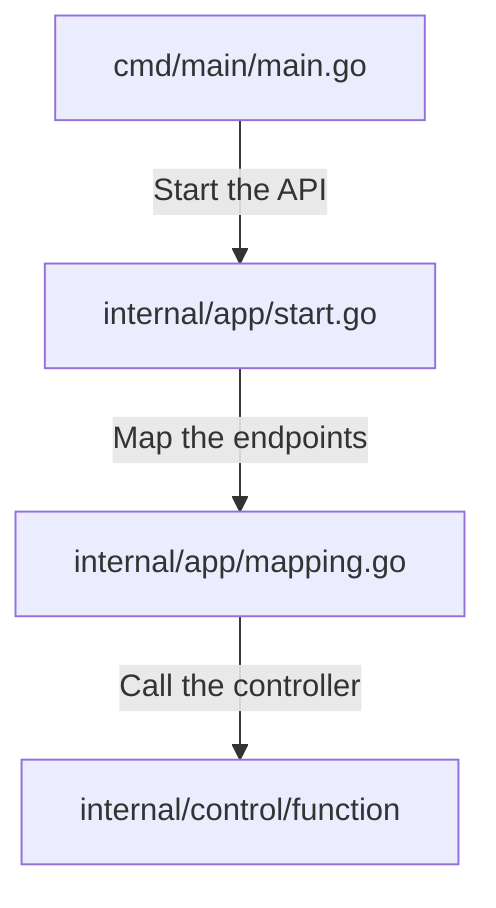

# Go API template

This project is mainly personnal, to have a quick ready-to-go API template in go using gin gonic

## How does it works ?
Main call `internal/apps/start.go` that boot up the API
start call `internal/apps/mapping.go` that create the endpoints
The endpoints calls `internal/control/name.go` or whatever you want

## Whats'up with the weird folders ?

It may not be very intuitive (as some people just goes with a `src/` folder just like Java) but I actually follow Golang Project Layout for optimized best practices regarding naming : https://github.com/golang-standards/project-layout

## Can use this for ...

Do whatever you want with that code. If it has been useful to you, please tweet @ThrynSec on Twitter, I'd love to know I've helped someone
